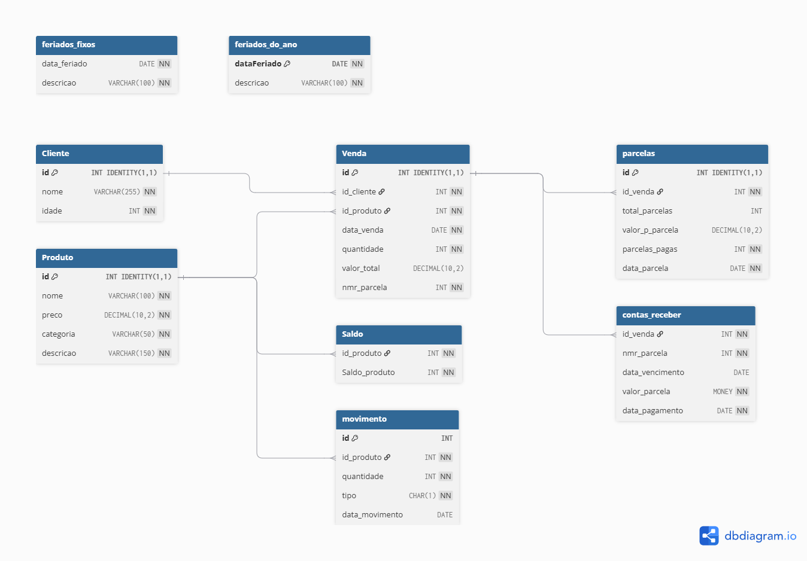

# BD2 — Estudos de Banco de Dados com SQL Server

Atividades práticas desenvolvidas durante o curso técnico de 
Desenvolvimento de Sistemas ETEC Fernando Prestes.

---

## 📁 Estrutura

```txt
/bd2
│
├── /procedures -> storaged procedures de Locação e clientes
│   ├── /triggers
│   │    └── trigger_filmes.sql
│   ├── procedure_ClientesCidade.sql
│   ├── procedure_DevolverFilme.sql
│   ├── procedure_incluirLocacao.sql
│   ├── procedure_aniversario.sql
│   └── procedure_crud.sql
│
└── /venda -> sistema financeiro, tabelas e inserts
    ├── /triggers
    │   └── triggers_venda.sql
    ├── inserts.sql
    └── venda.sql
```

## Tecnologias

- SQL Server
- T-SQL

## DIAGRAMA DO BANCO: FINANCEIRO



## 🎓 AUTORIA

Atividades desenvolvidas no 2º ano do curso técnico em Desenvolvimento de Sistemas 
— ETEC Fernando Prestes, Sorocaba/SP.  
Por: Vinicius Raphael e Caio Henrique
